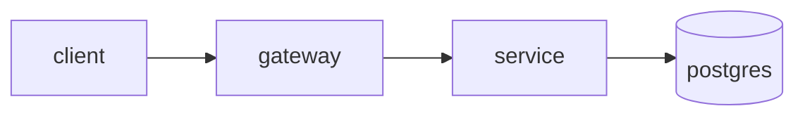

# Architecture

> What the services are, where the boundaries sit, and how data moves.
> Update when a boundary changes. If this repo is a single component, say so and keep it short.

## Shape

<!-- Components/services and what each owns. One line each. -->

## Boundaries

<!-- What must NOT cross. e.g. "core-hr never reads the sensitive schema; it calls the
     sensitive-data API." These are the lines an agent must not quietly redraw. -->

## Data flow

<!-- Request path and any async/event path. A mermaid diagram is welcome. -->

## External dependencies

<!-- Third-party services, what happens when each is down. -->
